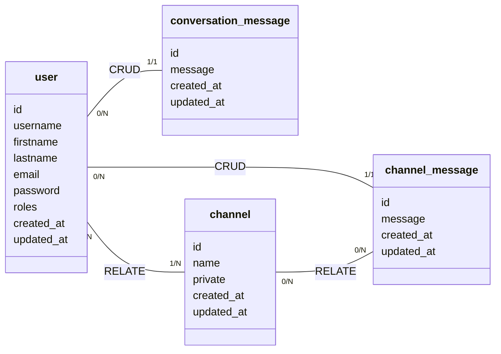

# Modèle Conceptuel de Données

[Voir sur l'éditeur de mermaid.js](https://mermaid.live/edit#pako:eNqlkkFrwzAMhf-K0bml69W3sfZWdki3m6EIW23NEjvITsco_e-z44SUUka3nfKe0PtkOT6D9oZAgq4xhJXFA2OjnBDGMulovRObKvsuEAsFT4tXBWI-T3K5WCapvTsRB8ytu4ZCwAMJKV6q99WPsSM6R3XqrNab57f1A7136CPlodA0SPTZvHA_89zXhDXlm0sOGypubznEyabQlaMGbV1km2ifngcG-5pCkZoJI5kdxgHfmit_UW46zLjOzYGmeS3bUwr_FTxexg1_qP6eeufX_wMNM2iI042a9Bx7joJ4pLQ7yCQN8ocC5XIfdtFvv5wGGbmjGRTS8HpB7rEOdPkGH93sGQ)
